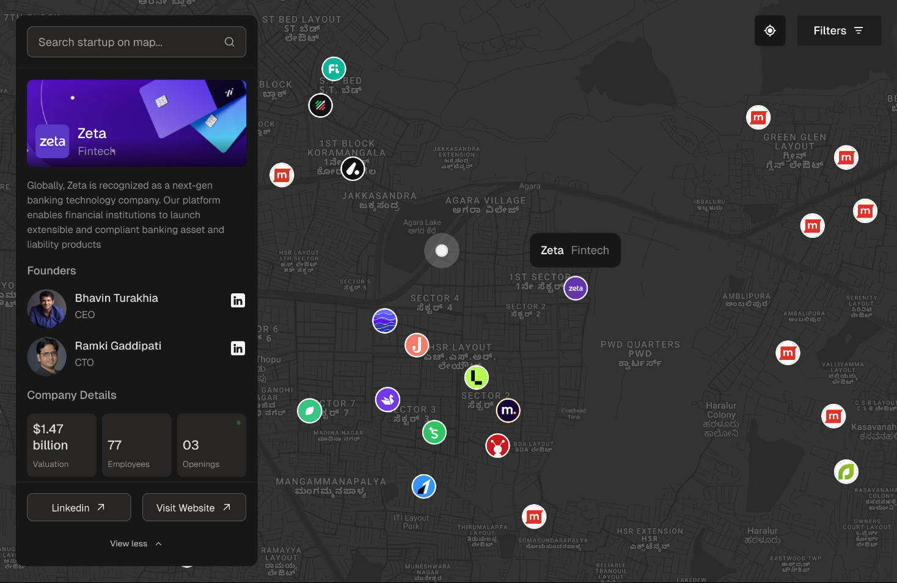

# 🗺️ Bangalore Startups Map

**A platform for discovering and indexing startups across Bangalore.**  
Built using **Leaflet.js**, **MapLibre GL**, and a **Flask** backend.

---

## 🚀 Overview

Bangalore Startups Map is a web platform that visualizes startups in Bangalore on an interactive map. The goal is to provide a clear, indexed, and visually appealing way for users to discover the city's growing startup ecosystem.

The application uses:

- 🗺️ **Leaflet.js** with `jawg.dark` tiles for a modern dark-themed experience.
- 🌐 **MapLibre GL** for high-performance vector-based maps.
- 🐍 **Flask** to serve the backend and API logic.

---

## 📸 Demo

Check out [Friendly Neighbourhood Startups](https://banglore-startups-map.onrender.com/home)

Note: You might have to wait aroud 50s for the page to load the first time (Site is hosted with a free plan on Render)

<br>
---

## 🔧 Tech Stack

| Technology   | Role                          |
|--------------|-------------------------------|
| Leaflet.js   | Interactive map rendering     |
| Jawg Maps    | Tile provider (`jawg.dark`)   |
| MapLibre GL  | Vector map rendering          |
| Flask        | Python backend and API        |
| HTML/CSS/JS  | Frontend templating           |

---

## 🏗️ Features

- 🔍 Discover startups on the map by location.
- 📍 Add new startups to the map with coordinates.
- 🗂️ Indexed entries with metadata (name, description, founders, valuations, openings etc.).
- 🎨 Beautiful dark-themed map interface.
- 📡 Flask-based API for backend data operations.

---

## 🛠️ Setup Instructions

### Prerequisites

- Python 3.8+
- `pip`
- A `Jawg Maps API Key` (for dark tiles)
- [MapLibre GL JS](https://maplibre.org/projects/maplibre-gl-js/)

### Clone the Repository

```bash
git clone https://github.com/your-username/bangalore-startups-map.git
cd bangalore-startups-map
```

### Install Dependencies

```bash
pip install -r requirements.txt
```

### Set Environment Variables

Create a `.env` file and add your API key:

```env
DATABASE_URL=postgresql_database_url
ADMIN_PWD_HASHED=your_admin_password_hashed_using_bcrypt #to add new startups
```

### Run the Flask App

```bash
gunicorn app:app
```

Visit `http://localhost:8000` in your browser.

---

## 📌 Roadmap

* [ ] Request panel for startups
* [ ] Admin panel to approve new listings

---

## 📬 Contact

For questions, or collaborations, feel free to reach out:
**Ibinu Jaleel** – \[[ibinu_b240197cs@nitc.ac.in](mailto:ibinu_b240197cs@nitc.ac.in)]
